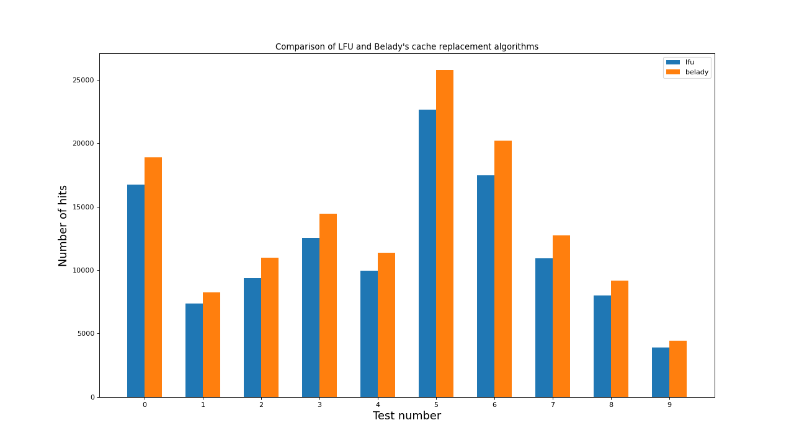

# HWC - caches

This project is the first task on course "Uses and applications of the C++ language" by [K.I.Vladimirov](https://github.com/tilir). The task was to implement one of suggested cache replacement algorithms. I chose LFU cache.

## Project structure

4 cache algorithms were implemented: [naive](./lfu/include/lfu_naive.hpp) and [O(1)](./lfu/include/lfu.hpp) LFU, [naive](./belady/include/belady_naive.hpp) and [O(n)](./belady/include/belady.hpp) Belady's algorithm.

## How to install
```bash
git clone git@github.com:KetchuppOfficial/LFU_Cache.git
cd LFU_Cache
```

## How to generate tests

If you want to run some tests, go to [./tests](./tests/) directory.

Let **N** be the number of tests you want to run, then command sequence:
```bash
./tester.sh mode N
```
generates **N** tests, builds naive cache and runs it on the tests to compute answers. After that fast cache is run on those tests to compute its own answers. Finally, both sets of answers are compared. If answers on the same test differ between naive and fast implementations, then this test is considered "failed". It is considered "passed" otherwise. **mode** argument has to be of one of 2 values only: "lfu" or "belady". It specifies what algorithm will be tested.

## Comparison of algorithms

If you want to build a bar chart that compares results of two algorithms on the generated tests, go to [./tests](./tests/) directory.

Let **N** be the number of tests you want to be represented in the bar chart, then command sequence:
```bash
./graph_builder.sh N
```
generated **N** tests, builds fast caches and runs them of those tests. After that a python script builds a bar chart based on the results of each cache in each test.

Here is an example of a bar chart:

